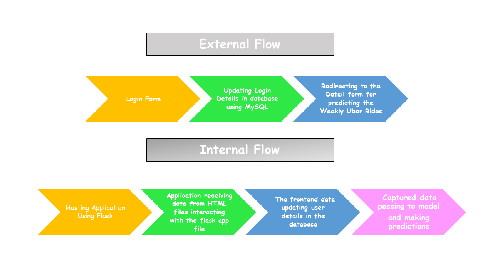
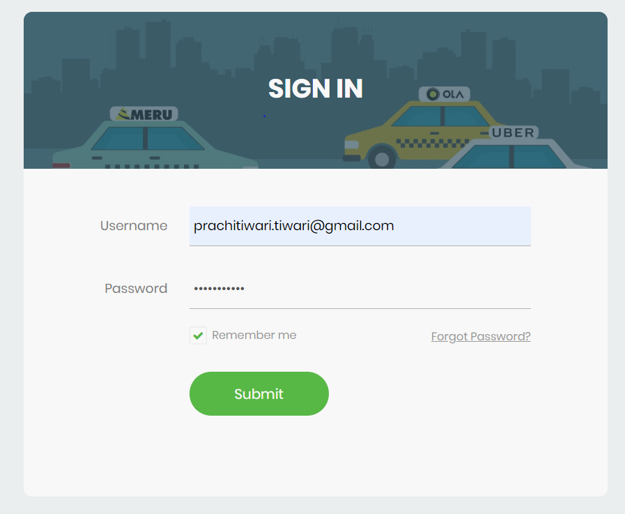
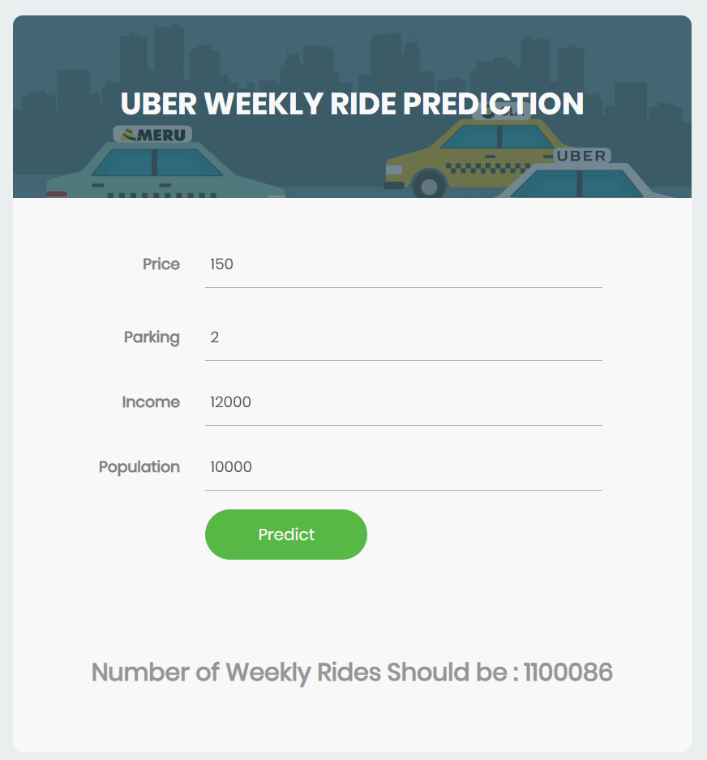

# Uber Weekly Rides Prediction

# Requirements
1. pip install numpy
2. pip install pickle4
3. pip install mysql-connector-python
4. pip install Flask
6. pip install pandas
7. pip install sklearn
8. pip install matplot

# Objective
Model is predicting the weekly number of uber rides on the basis of input features 
1. Price per week
2. Population
3. Monthly income
4. Average parking per month
5. Number of weekly riders (Target Fetaure)

# Project Flow Diagram

# Output

